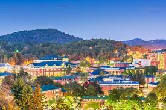

T D O W E L L M A P S
=========

## Senior Geography Student, [Applachain State University](https://geo.appstate.edu/)

#### Boone, North Carolina, USA

  

Expertise
-----
<ul>
    <li>ArcGIS Pro</li>
    <li>QGIS</li>
    <li>R Studio</li>
    <li>Python</li>
</ul>

Education
-----
Bachelor of Science Degree, General Geography, *2024*
GIS Certification *2024*
Appalachian State University

Professional Experience
-------
 <ul>
    <li>Grounds Laborer for Park District</li>
    <li>Customer Service Representitve</li>
    <li>File, product, and shipping manager </li>
</ul>